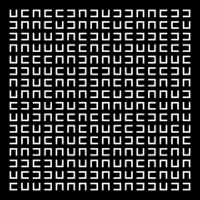
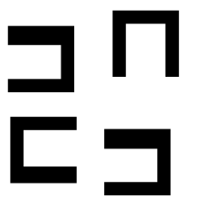
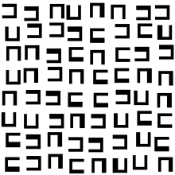

# Altepetl

`altepetl` *noun* — Classical Nahuatl: [1] city-state — local, ethnically-based political entity constituted of smaller units known as calpolli.

## Synopsis

Implements an artful grid-based layout of "U"-shapes; inspired by some of generative art pioneer [Véra Molnar](http://www.veramolnar.com)'s artworks.

## Requirements

An installation of `Python 3` (any version above v3.5 will do fine). For the optional `PNG` output support an installation of
the `cairosvg` 3rd-party Python module is recommended. The module can be installed with Python's package manager:

``` shell
pip --install cairosvg --user
```

## Output Examples

 
 

## Usage

```
usage: altepetl.py [-V] [-h] [--columns INT] [--rows INT] [--scale FLOAT]
                   [--gap FLOAT] [--shape-variation FLOAT]
                   [--offset-jiggle FLOAT] [--random-seed INT]
                   [--separate-paths] [--negative] [--frame FLOAT]
                   [-o FILENAME] [--output-size INT]

Startup:
  -V, --version         show version number and exit
  -h, --help            show this help message and exit

Algorithm:
  --columns INT         number of grid columns  [:11]
  --rows INT            number of grid rows  [:11]
  --scale FLOAT         base scale factor of the grid elements [:10.0]
  --gap FLOAT           non-random base gap between grid elements [:5.0]
  --shape-variation FLOAT
                        variation factor for the shape's inner "cut out" area
                         [:1.0]
  --offset-jiggle FLOAT
                        randomizing factor for horizontal and vertical shifts
                        of the element's coordinates  [:2.0]
  --random-seed INT     fixed initialization of the random number generator
                        for predictable results

Miscellaneous:
  --separate-paths      generate separate <path> elements for each element
  --negative            inverse the output colors
  --frame FLOAT         extra spacing around the grid (additionally to
                        potential gap spacing on the outside)  [:20.0]

Output:
  -o FILENAME, --output FILENAME
                        optionally rasterize the generated vector paths and
                        write the result into a PNG file (requires the
                        `svgcairo' Python module)
  --output-size INT     force pixel width of the raster image, height is
                        automatically calculated; if omitted the generated SVG
                        viewbox dimensions are used
```

### Usage Examples
``` shell
# Generate a SVG file
./altepetl.py --columns=8 -rows=5 > output.svg

# Rasterize directly into a PNG file (requires "cairosvg")
./altepetl.py --negative -o output.png
```

``` shell
# Preview output with ImageMagick's "convert" and Preview.app (Mac OS X)
./altepetl.py --columns=4 --rows=4 --random-seed=12345 | convert svg:- png:- | open -f -a Preview.app

# Preview output with ImageMagick's "convert" and "display" (Linux/BSD/etc.)
./altepetl.py --columns=4 --rows=4 --random-seed=12345 | convert svg:- png:- | display
```

## History

<table>
    <tr>
        <td valign=top>1.2</td>
        <td valign=top nowrap>18-Jun-2020</td>
        <td>Fixed PNG saving when `--output-size` was not passed.</td>
    </tr>
    <tr>
        <td valign=top>1.1</td>
        <td valign=top nowrap>09-Jun-2020</td>
        <td>Initial public source code release</td>
    </tr>
</table>