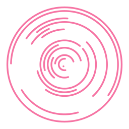

# Comitl

`comitl` *noun* — Classical Nahuatl: [1] cooking pot, pan — a rounded or cylindrical container used to heat up meals over a fire.

### Synopsis

Concentrically arranges randomly sized arcs into a pretty disc shape. Output is generated as a set of vector shapes in Scalable
Vector Graphics (SVG) format and printed on the standard output stream.

### Requirements

An installation of `Python 3` (any version above v3.5 will do fine). For the optional `PNG` output support an installation of
the `cairosvg` 3rd-party Python module is recommended. The module can be installed with Python's package manager:

``` shell
pip --install cairosvg --user
```

### Output Examples





### Usage

```
usage: comitl.py [-V] [-h] [--circles INT] [--stroke-width FLOAT]
                 [--gap FLOAT] [--inner-radius FLOAT] [--hoffset FLOAT]
                 [--voffset FLOAT] [--color COLOR] [--random-seed INT]
                 [--randomize] [--separate-paths]
                 [--outline-mode {both,outside,inside,none}]
                 [--background-color COLOR] [--disc-color COLOR]
                 [--animation-mode {random,bidirectional,cascade-in,cascade-out}]
                 [--animation-duration FLOAT] [--animation-offset FLOAT]
                 [-o FILENAME] [--output-size INT]

Startup:
  -V, --version         show version number and exit
  -h, --help            show this help message and exit

Algorithm:
  --circles INT         number of concentric arc elements to generate inside
                        the disc  [:21]
  --stroke-width FLOAT  width of the generated strokes  [:6]
  --gap FLOAT           distance between the generated strokes
  --inner-radius FLOAT  setup inner disc radius to create an annular shape
  --hoffset FLOAT       shift the whole disc horizontally  [:0.0]
  --voffset FLOAT       shift the whole disc vertically  [:0.0]
  --color COLOR         SVG compliant color specification or identifier
                         [:black]
  --random-seed INT     fixed initialization of the random number generator
                        for predictable results
  --randomize           generate truly random disc layouts; other algorithm
                        values provided via command line parameters are
                        utilized as limits

Miscellaneous:
  --separate-paths      generate separate <path> elements for each arc;
                        automatically implied when animation support is
                        enabled
  --outline-mode {both,outside,inside,none}
                        generate bounding outline circles  [:both]
  --background-color COLOR
                        SVG compliant color specification or identifier; adds
                        a background <rect> to the SVG output
  --disc-color COLOR    SVG compliant color specification or identifier; fills
                        the background of the generated disc by adding an
                        extra <circle> element
  --animation-mode {random,bidirectional,cascade-in,cascade-out}
                        enables SVG <animateTransform> support
  --animation-duration FLOAT
                        defines base duration of one full 360° arc rotation
                        (in seconds); negative inputs switch to counter-
                        clockwise base direction  [:6.0]
  --animation-offset FLOAT
                        offset the animation (in seconds) to support rendering
                        to frame sequences for frame based animation formats.
                         [:0]

Output:
  -o FILENAME, --output FILENAME
                        optionally rasterize the generated vector paths and
                        write the result into a PNG file (requires the
                        `svgcairo' Python module)
  --output-size INT     force pixel width and height of the raster image; if
                        omitted the generated SVG viewbox dimensions are used
```

#### Usage Examples
``` shell
# Generate a SVG file
./comitl.py --circles=10 --color=green > output.svg

# Rasterize directly into a PNG file (requires "cairosvg")
./comitl.py --circles=10 --disc-color=black --color=#fff -o output.png
```

``` shell
# Preview output with ImageMagick's "convert" and Preview.app (Mac OS X)
./comitl.py --randomise | convert svg:- png:- | open -f -a Preview.app

# Preview output with ImageMagick's "convert" and "display" (Linux/BSD/etc.)
./comitl.py --randomise | convert svg:- png:- | display
```

Creating frame-based animations (for use in VFX applications like BlackMagic Fusion, After Effects, etc.) is
possible by utilizing the `--animation-offset` parameter to manually advance the SVG animation, f.ex. a quick bash script
like this would create a 10s clip in `Apple ProRes 4444` format with the help of `ffmpeg`:
 
~~~ shell
#!/bin/bash

if mkdir -p './output_frames'; then
	framerate=`bc -l <<< "30000/1001"`  # NTSC
	
	for frame in {0..299}; do
		offset=`bc -l <<< "${frame}/${framerate}"`
		filename=`printf 'frame%04d.png' ${frame}`
	
		./comitl.py \
			--random-seed=12345              \
			--animation-mode=random          \
			--animation-offset="${offset}"   \
			--color=#334455                  \
			--background-color=#ddeeff       \
			--output-size=480                \
			-o "./output_frames/${filename}"
	done
	
	ffmpeg \
		-f image2                          \
		-framerate "${framerate}"          \
		-i "./output_frames/frame%04d.png" \
		-c:v prores_ks -profile:v 4        \
		"./output_frames/output.mov"
fi
~~~

### History

<table>
    <tr>
        <td valign=top>1.6</td>
        <td valign=top nowrap>22-May-2020</td>
        <td>
			<ul>
				<li>Added support for SVG animations with 4 different modes (`--animation-mode`, `--animation-duration`, and `--animation-offset` options)
			</ul>
		</td>
    </tr>
    <tr>
        <td valign=top>1.5</td>
        <td valign=top nowrap>22-May-2020</td>
        <td>
			<ul>
				<li>Added support for rasterized PNG output (using `cairosvg`)
				<li>Added `--separate-paths` option
				<li>Utilize Python's own xml module to generate the SVG data (not that this really improves the code in any way)
				<li>Improved render aspects to avoid various stroke overlapping issues
				<li>Added `--background-color` and `--disc-color` options
				<li>Added `--outline-mode` option
				<li>Constant ratio for the image border area
			</ul>
		</td>
    </tr>
    <tr>
        <td valign=top>1.4</td>
        <td valign=top nowrap>20-May-2020</td>
        <td>
			<ul>
				<li>Allow arc specification in degree
				<li>Arcs are now initialized with angular offsets and ranges
				<li>Improved code reusability and scope separation
			</ul>
		</td>
    </tr>
    <tr>
        <td valign=top>1.3</td>
        <td valign=top nowrap>19-May-2020</td>
        <td>
			<ul>
				<li>Refactored in preparation for new features
				<li>Optimizations
			</ul>
		</td>
    </tr>
    <tr>
        <td valign=top>1.2</td>
        <td valign=top nowrap>18-May-2020</td>
        <td>
			<ul>
				<li>Utilize SVG groups in the generated output
				<li>Added automatic identifiers to the SVG elements
				<li>Updated help text
			</ul>
		</td>
    </tr>
    <tr>
        <td valign=top>1.1</td>
        <td valign=top nowrap>18-May-2020</td>
        <td>Initial public release</td>
    </tr>
</table>