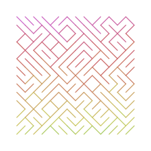
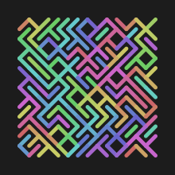

# Temo

`temo` *verb* — Classical Nahuatl: [1] to descend, to go down.

## Synopsis

Creates a colorful maze inspired by a famous one line C64 BASIC program (`10 PRINT CHR$(205.5+RND(1)); : GOTO 10`). Output is generated as a set
of vector shapes in Scalable Vector Graphics (SVG) format and printed on the standard output stream.

## Requirements

An installation of `Python 3` (any version above v3.5 will do fine). For the optional `PNG` output support an installation of
the `cairosvg` 3rd-party Python module is recommended. The module can be installed with Python's package manager:

``` shell
pip --install cairosvg --user
```

## Output Examples

 
 


## Usage

```
usage: temo.py [-V] [-h] [--columns INT] [--rows INT] [--scale FLOAT]
               [--random-seed INT] [--frame FLOAT] [--stroke-width FLOAT]
               [--background-color COLOR] [--hue-shift FLOAT] [-o FILENAME]
               [--output-size INT]

Startup:
  -V, --version         show version number and exit
  -h, --help            show this help message and exit

Algorithm:
  --columns INT         number of grid columns  [:11]
  --rows INT            number of grid rows  [:11]
  --scale FLOAT         base scale factor of the grid elements [:10.0]
  --random-seed INT     fixed initialization of the random number generator
                        for predictable results

Miscellaneous:
  --frame FLOAT         increase or decrease spacing around the maze  [:20.0]
  --stroke-width FLOAT  width of the generated strokes  [:2.0]
  --background-color COLOR
                        SVG compliant color specification or identifier; adds
                        a background <rect> to the SVG output
  --hue-shift FLOAT     amount to rotate an imaginary color wheel before
                        looking up new colors (in degrees)  [:15.0]

Output:
  -o FILENAME, --output FILENAME
                        optionally rasterize the generated vector paths and
                        write the result into a PNG file (requires the
                        `svgcairo' Python module)
  --output-size INT     force pixel width of the raster image, height is
                        automatically calculated; if omitted the generated SVG
                        viewbox dimensions are used
```

### Usage Examples
``` shell
# Generate a SVG file
./temo.py --columns=8 -rows=5 > output.svg

# Rasterize directly into a PNG file (requires "cairosvg")
./temo.py --hue-shift=4 -o output.png
```

``` shell
# Preview output with ImageMagick's "convert" and Preview.app (Mac OS X)
./temo.py --random-seed=12345 | convert svg:- png:- | open -f -a Preview.app

# Preview output with ImageMagick's "convert" and "display" (Linux/BSD/etc.)
./temo.py --random-seed=12345 | convert svg:- png:- | display
```

## History

<table>
    <tr>
        <td valign=top>1.1</td>
        <td valign=top nowrap>19-Jun-2020</td>
        <td>Initial public source code release</td>
    </tr>
</table>