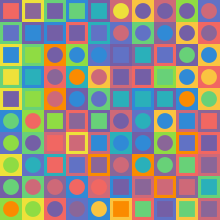
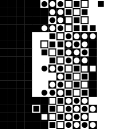
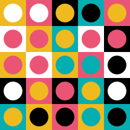
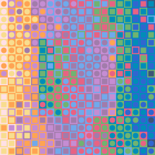

# Teocuitlatl

`teocuitlatl` *noun* — Classical Nahuatl: [1] gold, lit. wonderful waste

## Synopsis

Creates a grid of colored squares that are accentuated with smaller squares or discs inspired by works of *Victor Vasarely*. Additional
color palettes of works of other op-art artists including *Bridget Riley* and *Ellsworth Kelly* are included for further experimentation
with the theme. Output is generated as a set of vector shapes in Scalable Vector Graphics (SVG) format and printed on the standard
output stream.

## Requirements

An installation of `Python 3` (any version above v3.5 will do fine). For the optional `PNG` output support an installation of
the `cairosvg` 3rd-party Python module is recommended. The module can be installed with Python's package manager:

``` shell
pip --install cairosvg --user
```

## Output Examples

    

## Usage

```
usage: teocuitlatl.py [-V] [-h] [--columns INT] [--rows INT] [--no-inset]
                      [--inset-offset INT] [--no-horizontal-flip]
                      [--no-vertical-flip] [--color-bias INT] [--scale FLOAT]
                      [--padding FLOAT]
                      [--palette {shadowplay,spectrum9,binary,greyscale,rgb,yell}]
                      [--random-seed INT] [--randomize] [-o FILENAME]
                      [--output-size INT]

Startup:
  -V, --version         show version number and exit
  -h, --help            show this help message and exit

Algorithm:
  --columns INT         number of grid columns  [:11]
  --rows INT            number of grid rows  [:11]
  --no-inset            disable the default accent shape inset
  --inset-offset INT    manually force amount of frame tiles around the inset,
                        else it's automatically calculated
  --no-horizontal-flip  disable the default horizontal accent shape flip
  --no-vertical-flip    disable the default vertical accent shape flip
  --color-bias INT      increase amount of directional bias when choosing
                        random colors  [:1]
  --scale FLOAT         base scale factor of the grid elements  [:74.0]
  --padding FLOAT       manually force inner padding to control the frame
                        around the accent shapes
  --palette {shadowplay,spectrum9,binary,greyscale,rgb,yell}
                        choose random colors from the specified color scheme
                         [:default]
  --random-seed INT     fixed initialization of the random number generator
                        for predictable results
  --randomize           generate truly random layouts; other algorithm values
                        provided via command line parameters are utilized as
                        limits

Output:
  -o FILENAME, --output FILENAME
                        optionally rasterize the generated vector paths and
                        write the result into a PNG file (requires the
                        `svgcairo' Python module)
  --output-size INT     force pixel width of the raster image, height is
                        automatically calculated; if omitted the generated SVG
                        viewbox dimensions are used
```

### Usage Examples

``` shell
# Generate a SVG file
./teocuitlatl.py --columns=8 -rows=5 > output.svg

# Rasterize directly into a PNG file (requires "cairosvg")
./teocuitlatl.py -o output.png --output-size=1024
```

``` shell
# Preview output with ImageMagick's "convert" and Preview.app (Mac OS X)
./teocuitlatl.py --random-seed=12345 | convert svg:- png:- | open -f -a Preview.app

# Preview output with ImageMagick's "convert" and "display" (Linux/BSD/etc.)
./teocuitlatl.py --random-seed=12345 | convert svg:- png:- | display
```

## History

<table>
	<tr>
		<td valign=top>1.2</td>
		<td valign=top nowrap>4-Jul-2020</td>
		<td>
			<ul>
				<li>Parameters `--no-horizontal-flip`, `--no-vertical-flip`, and `--no-inset` are now also randomized
					when `--randomize` is used
			</ul>
		</td>
	</tr>
	<tr>
		<td valign=top>1.1</td>
		<td valign=top nowrap>3-Jul-2020</td>
		<td>Initial public source code release</td>
	</tr>
</table>